# 🚗 Car Dealer Website
My first bigger project so far (on GitHub) and first that is almost fully finished! 

This is a car dealership website that I built to learn database integration and modern web development. 
The project came about spontaneously when I got bored making "fake" databases and decided to dive into real database work.

I chose AppWrite as my backend solution and learned a ton during this quick late-night coding session (2am to 5am ☠️).
The website displays cars from a real database with filtering functionality, and I'm currently working on improving the UI/UX design to make it user-friendly and visually appealing.

I tried to use as little AI as possible; this is a typical learning/portfolio project. Obviously, I mostly used AI for repetitive tasks and formatting (in the sense of reducing work time).

# 📸 Screenshots
- Test gif 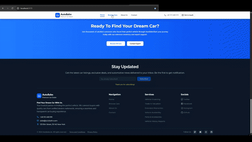
- Home page 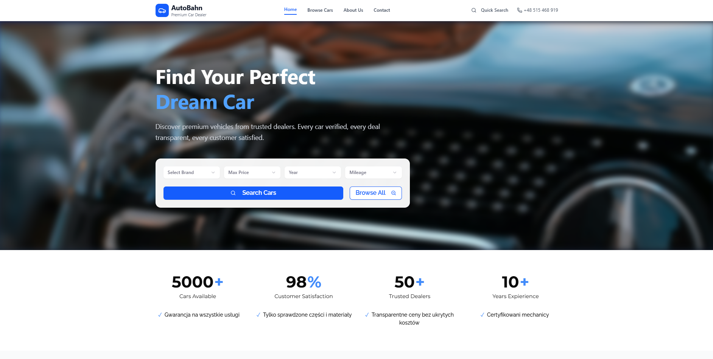
- Home page 2 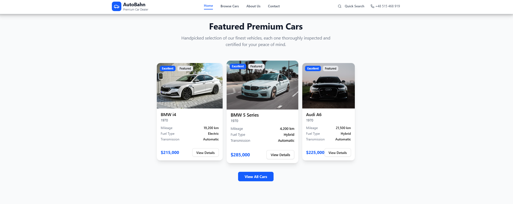
- Home page 3 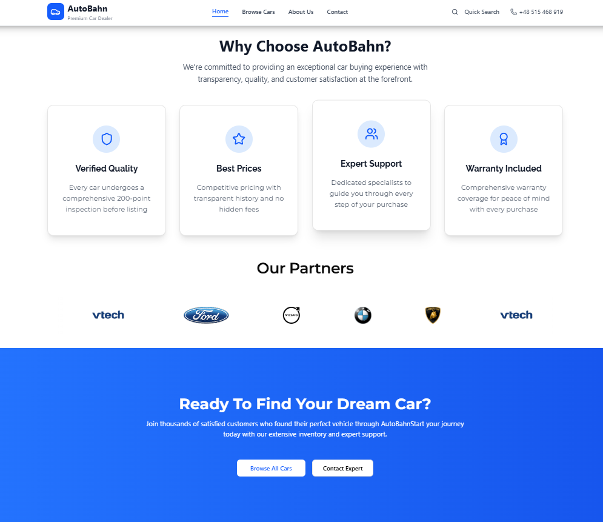
- *Featured Cars* 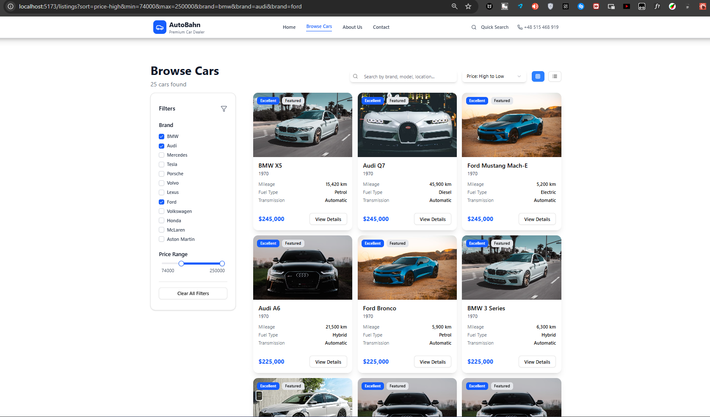
- *Contact Form* 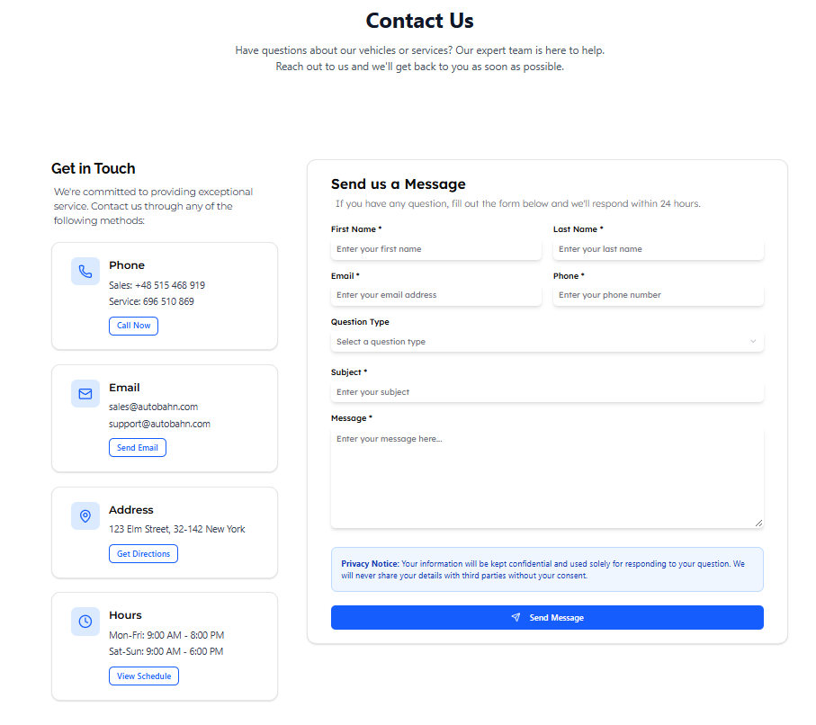
- *Mobile Responsibility* 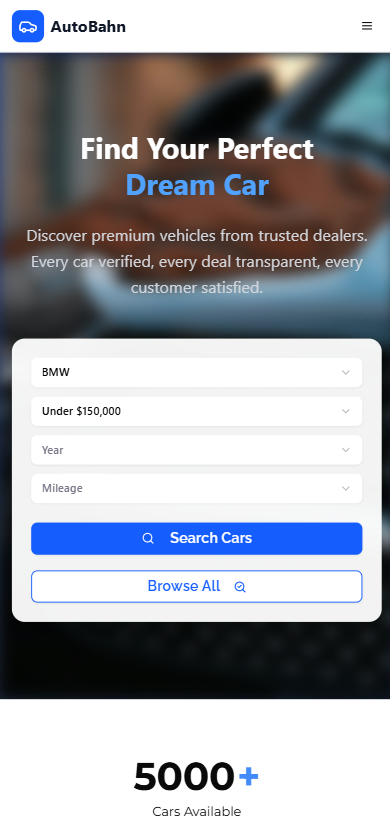
- *Footer* 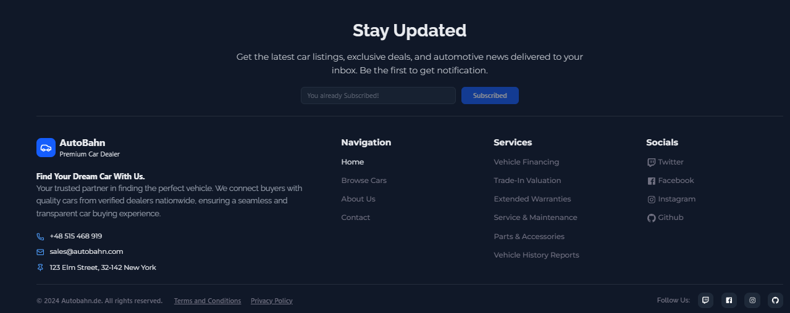


# 🎯 MVP (Minimum Viable Product)
The core functionality that's currently working:

- Car Database Integration: Real-time data fetching from AppWrite database
- Car Display System: Clean presentation of car listings with essential details
- Filtering System: Users can filter cars based on various criteria
- Responsive Base Layout: Basic responsive design for different screen sizes
- Database Queries: Advanced query merging and conditional array operations


# ✨ Features

- Responsive design foundation ✅
- Clean, modern UI using Tailwind CSS and shadcn components ✅
- Real-time car listings from AppWrite database ✅
- Advanced filtering system (make, model, price range, etc.) ✅
- Fast loading with Vite build system 🔨
- Database query optimization 🔨
- Car details page (user click view Details on car and got more informations about it in /car/{car_id}) - 🔨 currently going to do it
- Admin Panel with CRUD 🗺️ - in queue to create

# 🚀 Ideas for Future Enhancement / Missing Featuress

- Car detail pages 🔨(in progress)
- About page not implemented yet 🔨 in progress.
- Admin panel with CRUD, adding car to listings, newsletter email checking and Message from Contact Form reading and getting user details from it.
- Image gallery for each car (also upload multiple images by admin)
- Complete mobile responsiveness 🔨


# 🛠 Tech Stack
## Frontend:
- React - JavaScript library for building user interfaces
- TypeScript - Creating scripts, functions in project (.tsx)
- Vite - Fast build tool and development server
- Tailwind CSS - Utility-first CSS framework
- shadcn/ui - Modern React component library

## Backend & Database:

- AppWrite - Backend-as-a-Service for database and authentication

# Development Tools:

npm - Package manager
Git - Version control

# 🚀 Setup Instructions
Prerequisites

Node.js (v16 or higher)
npm or yarn
AppWrite account

# Step 1: Clone the Repository
```
git clone https://github.com/Marmo77/Car-Dealer_Website.git
cd Car-Dealer_Website
```
# Step 2: Install Dependencies
```
npm install
```
# Step 3: Set Up AppWrite

Create an account at AppWrite
Create a new project
Set up a database and collection for cars
Get your credentials:
```
PROJECT_ID
DATABASE_ID
ENDPOINT
COLLECTION_ID
```


# Step 4: Configure Environment Variables
Create a .env.local file in the root directory:
env
```
VITE_APPWRITE_PROJECT_ID=your_project_id
VITE_APPWRITE_DATABASE_ID=your_database_id
VITE_APPWRITE_ENDPOINT=your_endpoint
VITE_APPWRITE_COLLECTION_ID=your_collection_id
```


# Step 5: Run the Development Server
```
npm run dev
```
The application will be available at http://localhost:5173

# Build of the Database 🔨
- Cars
- 
- Messages
- 
- Newsletters
- 

# 🗺 Roadmap
## Phase 1: Core Improvements (Current)

- Implement About page
- Add car detail pages
- Improve error handling
- Complete mobile responsiveness

## Phase 2: User Features

- Favorites/Wishlist functionality (for now plan to make it in localStorage user)
- User reviews and ratings (maybe)

## Phase 3: Advanced Features

- Admin panel with CRUD
- Admin panel for adding/deleting Cars from listings
- Admin can see users mails from newsletters, see user details to message back to user from ContactForm

## Phase 4: Performance & Polish

- SEO optimization
- Performance improvements
- Advanced animations (motion div's)
- PWA capabilities


# 🧠 What I Learned
- This project was an incredible learning experience where I:

- Mastered real database integration with AppWrite
- Learned advanced query techniques (merging queries with conditional arrays)
- Improved my knowledge and understanding of TypeScript and JavaScript
- Improved my React skills with modern hooks and patterns
- Got hands-on experience with Tailwind CSS and component libraries
- Understood the importance of planning UI/UX before coding
- Learned to work with environment variables and API configuration

### The late-night coding session (2am-5am) taught me a lot about persistence and problem-solving.

# Some code snippets (totaly random files all in .ts,.tsx + folder structure) 💻

- 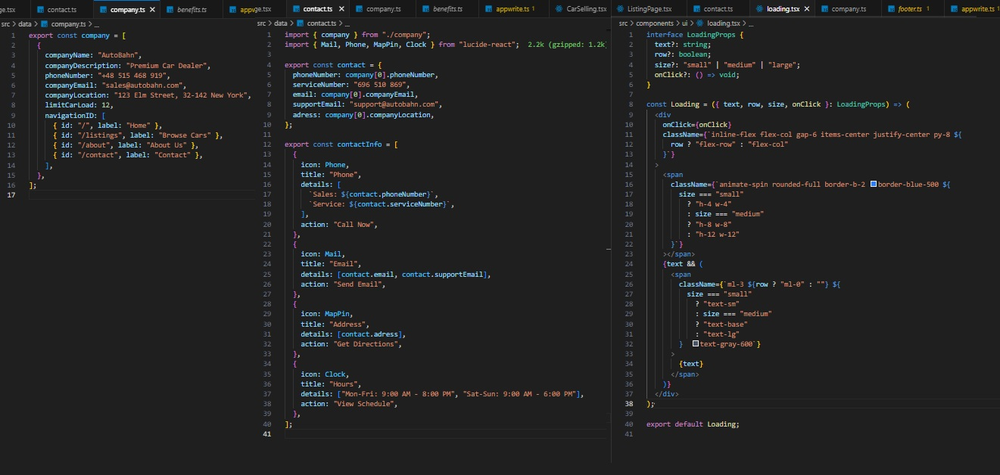
- 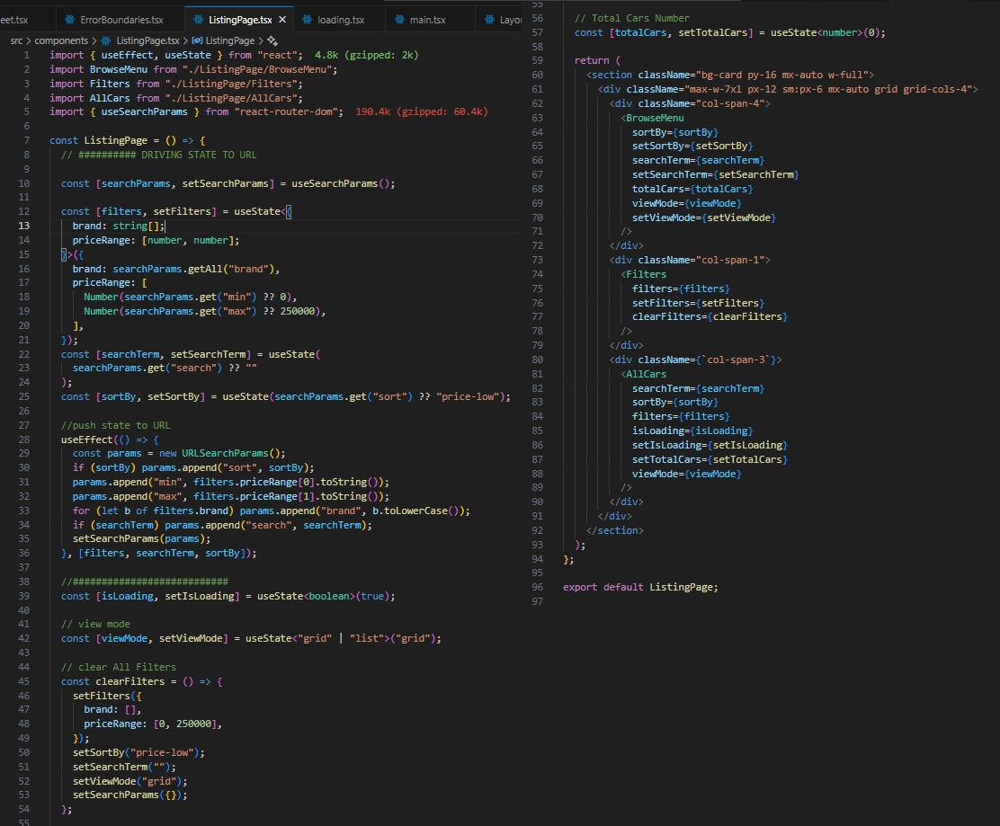
 
- 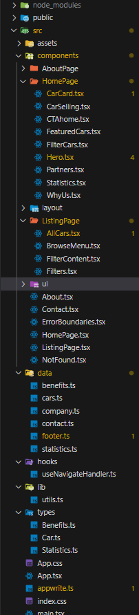

# 🤝 Contributing
This is primarily a learning project, but if you'd like to contribute:

* Fork the repository
* Create a feature branch (git checkout -b feature/amazing-feature)
* Commit your changes (git commit -m 'Add amazing feature')
* Push to the branch (git push origin feature/amazing-feature)
* Open a Pull Request


# 📝 License
- This project is open source and available under the MIT License.

# 📞 Contact
Marmo77 - GitHub: @Marmo77
Project Link: https://github.com/Marmo77/Car-Dealer_Website
